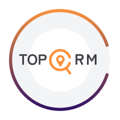

<span style="display: flex; justify-content: center"></span>

# TOPCRM

Rect Router を使った CRM テンプレート

## Features

- 🚀 Server-side rendering
- ⚡️ Hot Module Replacement (HMR)
- 📦 Asset bundling and optimization
- 🔄 Data loading and mutations
- 🔒 TypeScript by default
- 🎉 TailwindCSS for styling
- 📖 [React Router docs](https://reactrouter.com/)
- 📖 [React Router docs ja](https://react-router-docs-ja.techtalk.jp/)

## Getting Started

### Installation

```bash
bun install
```

### Development

```bash
bun run dev
```

Your application will be available at `http://localhost:5173`.

## Building for Production

```bash
bun run build
```

## Deployment

### Docker Deployment

- `Dockerfile.bun` - for bun

To build and run using Docker:

```bash
docker build -f Dockerfile.bun -t my-app .

# Run the container
docker run -p 3000:3000 my-app
```

- AWS ECS
- Google Cloud Run
- Azure Container Apps
- Digital Ocean App Platform
- Fly.io
- Railway

### DIY Deployment

If you're familiar with deploying Node applications, the built-in app server is production-ready.

Make sure to deploy the output of `npm run build`

```
├── package.json
├── package-lock.json (or pnpm-lock.yaml, or bun.lockb)
├── build/
│   ├── client/    # Static assets
│   └── server/    # Server-side code
```

## Styling

This template comes with [Tailwind CSS](https://tailwindcss.com/) already configured for a simple default starting experience. You can use whatever CSS framework you prefer.

---

Built with ❤️ using React Router.
